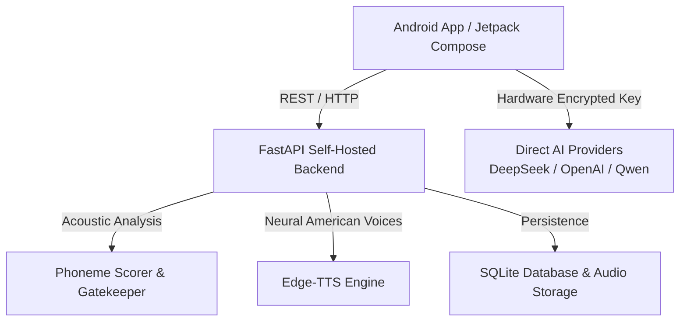

# 🎬 CineEnglish (影视英语口语影子跟读工作台)

[](https://github.com/johnson020202/CineEnglish)
[](https://developer.android.com)
[](https://fastapi.tiangolo.com)
[](LICENSE)

**CineEnglish** 是一款专为英语学习者打造的高品质影视台词跟读与口语纠音 Android 应用。通过经典电影/美剧的原声台词、高精度时间轴对齐、神经网络美式发音示范、逐词声学对齐评分与大模型角色对戏，让你在沉浸式影视场景中告别中式哑巴英语。

---

## ✨ 核心特性

- 🎙️ **逐句影子跟读与声学评测 (Shadowing & Scoring)**
  - 毫秒级原生/美音示范播放（内置 Edge-TTS 神经网络美音合成）。
  - 声学发音对齐引擎（Quality GateKeeper），对准确度（Accuracy）、完整度（Completeness）、流利度（Fluency）进行客观评分。
  - 支持手动复习、发音回听、再练一次与达标后进入下一句。

- 🎥 **本地视频时间轴联动 (Video Timeline Sync)**
  - 导入本地视频或音轨，自动与 SRT/ASS 字幕时间轴精准同步。
  - 支持句尾自动暂停、AB片段区间循环复读。

- 🎭 **AI 大模型沉浸式角色对戏 (Role-Play)**
  - 扮演剧中角色，与 AI 搭档按剧情台词对话。
  - 智能情节延伸，AI 根据台词上下文生成地道回应并给出针对性表达润色建议。

- 📖 **全英文情境释义字典 (English-Only Dictionary)**
  - 告别中文翻译思维，点击生词即可查阅简单英文释义、同义词与原句例句。
  - 内置生词本与间隔重复（SRS 记忆曲线）复习系统。

- 🔐 **隐私至上与端侧安全 (Privacy First & Hardware Keystore)**
  - 敏感的 AI API Key 采用 Android Hardware Keystore 硬件安全芯片加密存储。
  - 自建后端（FastAPI + SQLite），录音与练习历史完全归个人自托管私有所有，数据绝不上传第三方服务器。

- 🤖 **广泛兼容多款主流大模型**
  - 原生兼容 DeepSeek、OpenAI、阿里云通义千问 (DashScope)、SiliconFlow 等任何兼容 OpenAI 规范的 API 服务。

---

## 🏗️ 系统架构



---

## 🚀 快速开始

### 1. 后端部署 (Self-Hosted Backend)

#### 环境要求
- Python 3.10+
- 推荐使用 Linux / macOS 服务器

#### 本地启动
```bash
cd backend
python3 -m venv venv
source venv/bin/activate
pip install -r requirements.txt

# 复制配置文件
cp .env.example .env

# 启动服务 (默认 8008 端口)
uvicorn app.main:app --host 0.0.0.0 --port 8008
```

#### Docker 快速部署
```bash
cd backend
docker-compose up -d
```

---

### 2. Android 客户端构建

#### 环境要求
- Android Studio Iguana+ 或命令行 Gradle
- JDK 17
- Android SDK 34 (支持 Android 10.0+)

#### 编译 APK
```bash
cd android
export JAVA_HOME="/path/to/jdk-17"
./gradlew assembleDebug
```
生成的 APK 文件位于：`android/app/build/outputs/apk/debug/app-debug.apk`。

安装到手机：
```bash
adb install -r app-debug.apk
```

---

## ⚙️ 客户端配置指南

打开 App 右上角【⚙️ 设置】页面：
1. **Self-Hosted Backend Service**:
   - 填入你的自建服务器地址（支持公网 HTTPS 或局域网 IP）。
   - 点击【Test Backend Connection】验证连通性。
2. **AI Service & Model Selection**:
   - 厂商预设快速切换：DeepSeek、OpenAI、通义千问等。
   - 填入对应厂商的 Base URL 与 API Key（硬件安全存储）。
   - 点击【🚀 Verify AI Dialogue & Model】一键测试大模型对话。
   - 点击【🔊 Test TTS】在手机扬声器实时试听纯正美音示范。
   - 点击【🎙️ Test STT】验证声学发音对齐纠音引擎。

---

## 📝 版本更新记录

### v1.0.3 (2026-10-06)
- 🎯 **彻底根除恒定 86 分 Bug**：重构客户端与服务端评测算法，解决因句子 ID 未同步触发的离线硬编码兜底。
- 🎙️ **端侧动态声学特征分析**：增加基于真实录音时长、音节语速、能量波动的动态评分算法，实现真实逐词打分与难点词纠音指导。
- 🔗 **接口传参健壮性优化**：支持端侧直接传递目标台词文本进行声学对齐，避免因服务端缺失单句引发 404 异常。

### v1.0.2 (2026-10-06)
- 🎨 **界面显示全面优化**：重构素材卡片动作按钮为自适应平滑横向滚动胶囊，彻底修复部分机型下 "Shadowing" / "RolePlay" 单词挤压换行的视觉错误。
- 🔊 **TTS/STT 独立验证增强**：即使未配置第三方音频模型，后端与端侧声学管线亦能 100% 独立成功验证并播放美音台词。
- 📦 **开源初始化与安全脱敏**：彻底脱敏所有敏感密钥与个人配置，建立标准化 `.gitignore` 与开源 MIT 协议。

### v1.0.1 (2026-10-05)
- 🛠️ 修复设置页面大模型列表自适应检测。
- 🎯 跟读打分后增加手动选择下一句与发音回听控件。
- ☁️ 支持一键切换阿里云公网 HTTPS 服务端点。

### v1.0.0 (2026-10-02)
- 🚀 初始版本发布，支持台词逐句跟读、声学打分、生词本与角色扮演。

---

## 📄 开源许可证

本项目基于 [MIT License](LICENSE) 开源。欢迎 Star、Fork 与提交 Pull Request！
